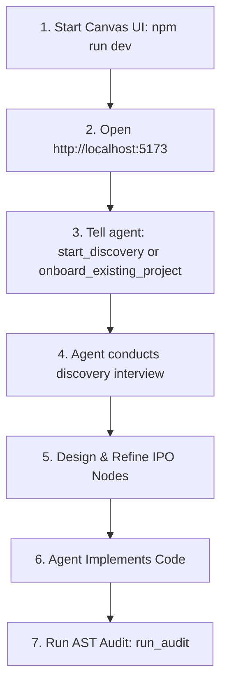

# Complete User & MCP Integration Guide — GraphIPO Framework v2

Welcome to the official user guide for **GraphIPO** (Graph Input-Process-Output Engineering).

For the complete **Global Installation & Per-Project Setup Manual in Spanish**, please refer to:
👉 **[INSTALLATION_AND_USAGE_GUIDE.md](INSTALLATION_AND_USAGE_GUIDE.md)**

---

## 🌐 Language & Naming Directives

1. **User Communication Language:** AI Agents communicate with the user in their **native conversational language** (e.g., Spanish, English).
2. **Internal Framework & Documentation:** All internal specification files, `README.md`, `SKILL.md`, and harness modules are maintained in **English**.
3. **Code & Pseudocode Naming Selector (`code_language`):**
   - Options: `EN` (English - default), `ES` (Spanish), or `CUSTOM`.
   - The MCP tool `set_code_language` and the Canvas UI header allow changing this setting dynamically.

---

## 🚀 1. Getting Started

### Start the Canvas UI
```bash
cd graph-ipo/canvas-ui
npm run dev
```
Open `http://localhost:5173` in your browser.

### MCP Server
The MCP server starts **automatically** when your AI agent connects (configured in your IDE's MCP settings).

---

## 🔌 2. Global MCP Server Configuration

GraphIPO automatically detects the active workspace directory (`process.cwd()`). The MCP server reads or creates the `.ipo/canvas.json` file inside whichever project directory your agent is working on.

### MCP Configuration Entry

In your global MCP config (`mcp_config.json`, `.cursor/mcp.json`, or Claude Desktop config):

```json
{
  "mcpServers": {
    "graph-ipo": {
      "command": "node",
      "args": ["<path-to>/graph-ipo/harness/dist/server.js"]
    }
  }
}
```

---

## 🎨 3. Recommended Step-by-Step Workflow



1. **Step 1: Start Canvas UI** (`npm run dev` → `http://localhost:5173`)
2. **Step 2: Tell your agent to begin** — use `start_discovery` for new projects or `onboard_existing_project` for existing codebases.
3. **Step 3: Discovery interview** — the agent asks questions about your project and generates the initial graph.
4. **Step 4: Edit or Refine Nodes** directly in the Canvas UI (double click any node to open the inspector).
5. **Step 5: Agent Implements Code** for nodes marked `READY_FOR_IMPLEMENTATION`.
6. **Step 6: Run AST Code Audit** via the `run_audit` tool to verify adherence.
